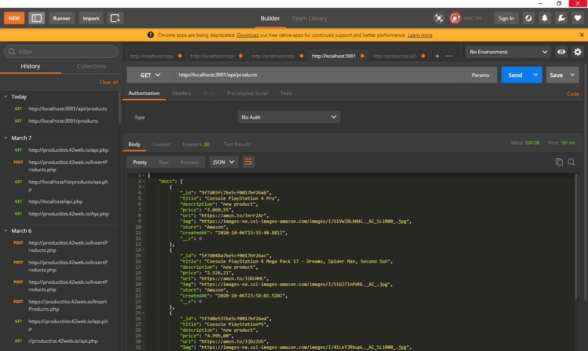
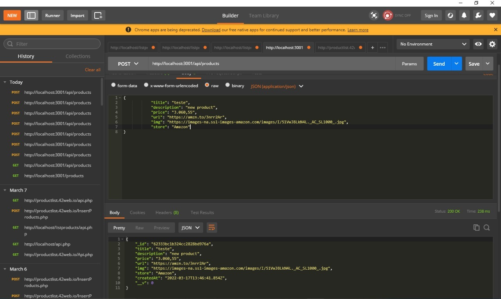
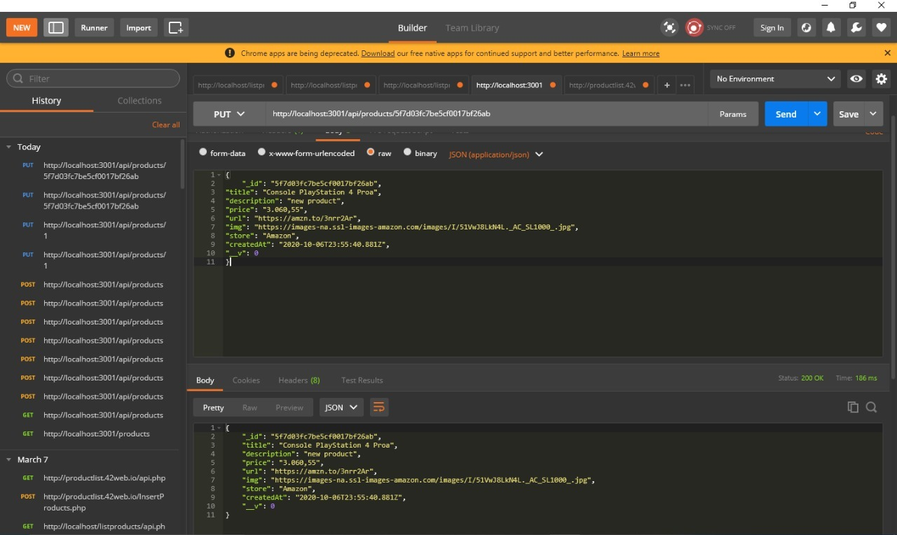

# api-main

this was my first project done in node js 
the api with mongodb , i made deploy this project
in the heroku is a api products crud , create,read,update,delete,
I made this project in 2020 .

# sample-node-api  
A sample node js api for finding Products and edit and delete products    

## Steps
    

## PART I: Download & Build on local

## Method 1: From github
### 1) Clone the repository, install node packages  and verify routes locally

``` 
//on local
git clone https://github.com/Jhongamers/api-main
cd api-main
npm install
npm start
```

Open your local browser and verify the sample-node-api is working by accessing:     
`http://localhost:18000/products/`   
`http://localhost:18000/products/1`   
`http://localhost:18000/products/1`   


## PART 2: Config necessary

### 1) you need mongodb 

``` 
//on local install or use the free mongodb in cloud
https://docs.mongodb.com/manual/installation/
https://www.mongodb.com/pt-br/cloud/atlas/register
```
### 2) you have put data

``` 
//server.js line 17 writedata your db mongodb or local or cloud
mongoose.connect(
     'mongodb+srv://<deploy>:<password>@cluster0.umtu1.mongodb.net/<dbname>?retryWrites=true&w=majority',
     {useNewUrlParser: true,useUnifiedTopology: true}
     );

```

## PART 3: start api

``` npm run start ```

 ### 1) acess the url using postman insomnia or google chrome

    **API List Products**
    
  
  
  ```http://localhost:3001/ ```


   **To List Porduct by Id**
   ```  
        http://localhost:3001/:id
        
        example: http://localhost:3001/5f7d03fc7be5cf0017bf26a
   ```


   **To Create Product**
    


   **Edit Product**
        
   ```  
        http://localhost:3001/:id
        
        example: http://localhost:3001/5f7d03fc7be5cf0017bf26a

        use insomnia or postman and Edit by id and body remember to use method put
      
   ```

     **Delete Product**
   ```  
        http://localhost:3001/:id
        
        example: http://localhost:3001/5f7d03fc7be5cf0017bf26a

        use insomnia or postman and delete by id remember to method delete
   ```


